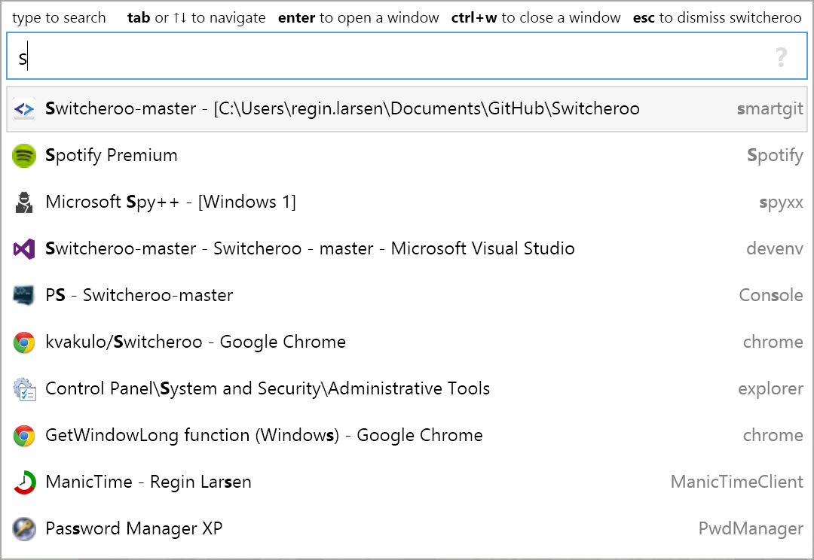

 Switcheroo_1C
==========

Утилита для быстрого переключения междку окнами приложений 1С, с использованием имен из ibases.v8i.

## Скриншоты

Загрузка
--------

**[Скачать Switcheroo_1C](https://github.com/WizaXxX/Switcheroo_1C/releases)**

Использование
-----

Action                               | Shortcut        | Remarks
------------------------------------ | --------------- | ----------
Активация Switcheroo_1C              | `Alt + Space`   | Сочетание клавиш можно изменить в _Options_
Активация Switcheroo_1C              | `Alt + Tab`     | Только если активирована специальная _Options_
_When Switcheroo is open_            |                 |
Переключиться на выбранное окно      | `Enter`         |
Закрыть выбранное окно               | `Ctrl + W`      |
Закрыть Switcheroo_1C                | `Esc`           |

## Оригинальный репозиторий
**[https://github.com/kvakulo/Switcheroo](https://github.com/kvakulo/Switcheroo)**
